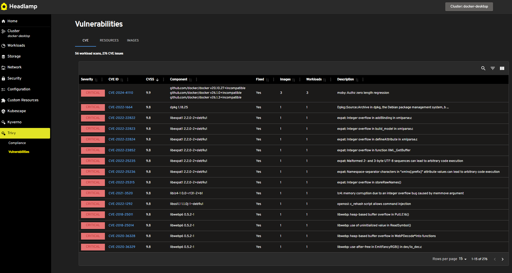

# Trivy Headlamp Plugin

The Trivy Headlamp plugin provides an open source plugin for Headlamp. It builds upon the work of [Trivy Operator](https://aquasecurity.github.io/trivy-operator) and [Headlamp](https://github.com/headlamp-k8s/headlamp).

Headlamp is a dashboard for Kubernetes, and is extensible with plugins. Trivy Operator is a security platform protecting against configuration issues and image vulnerabilities.

The Trivy Headlamp plugin provides views in Headlamp for configuration and vulnerabilities scanning, based on information delivered by the Trivy operator.

## Demo

## Prerequisites

- [Trivy operator](https://aquasecurity.github.io/trivy-operator/) should be installed in the k8s cluster and enabled for configuration and image scanning.
- [Headlamp](https://github.com/headlamp-k8s/headlamp) should be installed in the k8s cluster or workstation. For a quick test the desktop version is recommended.

The plugin has been tested with Headlamp v0.25.0 (browser and desktop) and Trivy operator helm chart v0.24.1.

## Use cases

The plugin provides view pages for Trivy custom resources, such as clustercompliance, configaudit, exposedsecret, infraassessment, rbacassessment, sbomreport and vulnerabilityreports.

## Installation

#### Desktop Headlamp

- Install Headlamp (https://headlamp.dev/docs/latest/installation/desktop/).
- Open Plugin Catalog.
- Select the Trivy Headlamp plugin and click the install button.
- After install you may need to restart Headlamp.

#### In-cluster Headlamp

- Install Headlamp (https://headlamp.dev/docs/latest/installation/in-cluster/)
- Add an initContainer to the headlamp deployment to download the trivy-plugin files. See [example helm values](examples/headlamp-helm-values.yaml).

## Contributing

Contributions are welcome! Please fork the repository and submit a pull request.

## License

This project is licensed under the Apache-2.0 License. See the LICENSE file for details.

## Contact

For any questions or feedback, please open an issue on the GitHub repository.
